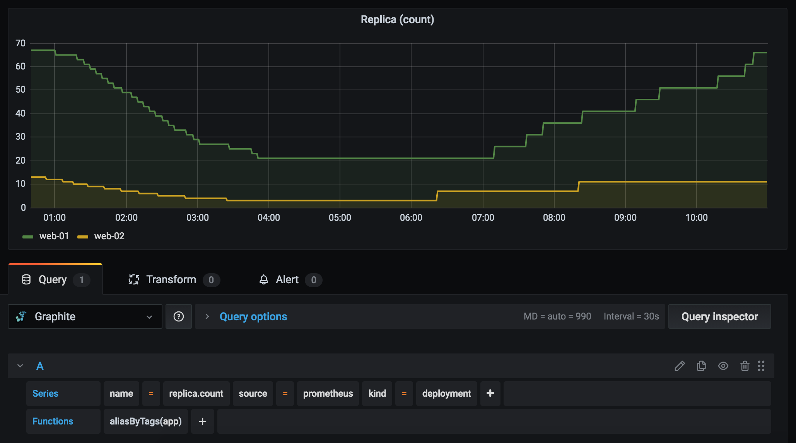

[](https://opensource.org/licenses/MIT)

## Overview
Python exporter to query Prometheus time-series data (metrics) and send it to Graphite

## Example output
```
workernode.count;source=prometheus;kind=node;team=devops;job=kube-state-metrics 23 1614349019
workernode.count;source=prometheus;kind=node;team=devops;job=kube-state-metrics 23 1614349079

replica.count;source=prometheus;kind=deployment;team=devops;app=web-01 9 1614349079
replica.count;source=prometheus;kind=deployment;team=devops;app=web-02 11 1614349079

Metrics sent for: 2 queries
```

## Grafana Graph (Graphite)


## Dependencies
- Python v3.6
- Prometheus endpoint should be accessible (http/https)
- Graphite v1.1.x or higher (if you want to use tagged series)
- Carbon should be accessible on plaintext port

## Configuration
This exporter can be run as a cronjob to fetch Prometheus time-series data on a regular interval

## License
Code released under the [MIT License](https://opensource.org/licenses/MIT)